<p align="center">
  
</p>

<h1 align="center">Wirestack UI</h1>

<p align="center">
  Système de design complet pour <strong>Laravel & Livewire 4</strong><br>
  70+ composants Blade · 5 composants Livewire · Tailwind CSS v4 · Mode sombre natif
</p>

<p align="center">
  <a href="https://packagist.org/packages/darken10/wirestack">
    
  </a>
  <a href="https://www.php.net">
    
  </a>
  <a href="https://laravel.com">
    
  </a>
  <a href="https://livewire.laravel.com">
    
  </a>
  <a href="LICENSE.md">
    
  </a>
</p>

---

## À propos

**Wirestack UI** est un système de design clé en main pour les applications Laravel & Livewire. Il fournit une bibliothèque de composants cohérents, accessibles et entièrement personnalisables, propulsés par **Tailwind CSS v4** et **Alpine.js**.

- **70+ composants Blade** — boutons, formulaires, cartes, navigation, tableaux, modales…
- **5 composants Livewire** — Modal, Drawer, Toast, DataTable, CommandPalette
- **Design tokens** — personnalisation globale via variables CSS sans toucher aux composants
- **Mode sombre natif** — prise en charge complète light / dark / system
- **Auto-découverte** — aucune configuration manuelle du service provider

---

## Installation

```bash
composer require darken10/wirestack
```

> Le service provider est auto-découvert par Laravel. Aucune déclaration manuelle n'est nécessaire.

Consultez le **[guide d'installation complet →](docs/installation.md)** pour configurer les assets CSS, les directives Blade et les composants Livewire globaux.

---

## Démarrage rapide

Ajoutez les directives dans votre layout principal :

```blade
<!DOCTYPE html>
<html lang="{{ str_replace('_', '-', app()->getLocale()) }}">
<head>
    <meta charset="utf-8">
    <meta name="viewport" content="width=device-width, initial-scale=1">

    @wsStyles
    @vite(['resources/css/app.css', 'resources/js/app.js'])
</head>
<body>

    {{ $slot }}

    <livewire:ws::toast />

    @wsScripts
</body>
</html>
```

Puis utilisez les composants dans vos vues :

```blade
<x-ws::button variant="solid" color="primary" icon="plus">
    Créer un projet
</x-ws::button>

<x-ws::alert color="success" dismissible>
    Vos modifications ont été enregistrées.
</x-ws::alert>

<x-ws::card variant="elevated">
    <x-ws::card-header title="Tableau de bord" />
    <x-ws::card-body>
        Contenu de la carte...
    </x-ws::card-body>
</x-ws::card>
```

---

## Documentation

### Site de documentation multilingue (FR/EN)

Un site de documentation complet est disponible ici :

- `packages/wirestack/docs/site/index.html`

Fonctionnalités incluses :

- interface responsive desktop/mobile
- bascule de langue français/anglais
- recherche instantanée par section (titre, résumé, tags, contenu)
- navigation ancrée rapide par chapitre

Pour l'ouvrir localement, lancez simplement le fichier HTML dans un navigateur.

| Sujet                 | Lien                                             |
| --------------------- | ------------------------------------------------ |
| Installation          | [docs/installation.md](docs/installation.md)     |
| Configuration         | [docs/configuration.md](docs/configuration.md)   |
| Design Tokens         | [docs/design-tokens.md](docs/design-tokens.md)   |
| Directives Blade      | [docs/directives.md](docs/directives.md)         |
| API JavaScript        | [docs/javascript-api.md](docs/javascript-api.md) |
| Théming & Mode sombre | [docs/theming.md](docs/theming.md)               |

### Composants Blade

| Catégorie                                 | Documentation                                                      |
| ----------------------------------------- | ------------------------------------------------------------------ |
| Atomes — Button, Badge, Avatar, Spinner…  | [docs/components/atoms.md](docs/components/atoms.md)               |
| Formulaires — Input, Select, Toggle…      | [docs/components/forms.md](docs/components/forms.md)               |
| Mise en page — Card, Container, Stack…    | [docs/components/layout.md](docs/components/layout.md)             |
| Navigation — Breadcrumb, Pagination, Nav… | [docs/components/navigation.md](docs/components/navigation.md)     |
| Feedback — Alert, Progress, Skeleton…     | [docs/components/feedback.md](docs/components/feedback.md)         |
| Données — Table, Stat, Timeline, Code…    | [docs/components/data-display.md](docs/components/data-display.md) |
| Interactifs — Dropdown, Tabs, Accordion…  | [docs/components/interactive.md](docs/components/interactive.md)   |

### Composants Livewire

| Composant      | Documentation                                                        |
| -------------- | -------------------------------------------------------------------- |
| Modal          | [docs/livewire/modal.md](docs/livewire/modal.md)                     |
| Drawer         | [docs/livewire/drawer.md](docs/livewire/drawer.md)                   |
| Toast          | [docs/livewire/toast.md](docs/livewire/toast.md)                     |
| DataTable      | [docs/livewire/datatable.md](docs/livewire/datatable.md)             |
| CommandPalette | [docs/livewire/command-palette.md](docs/livewire/command-palette.md) |

---

## Prérequis

| Dépendance   | Version minimale       |
| ------------ | ---------------------- |
| PHP          | 8.2+                   |
| Laravel      | 11.x ou 12.x           |
| Livewire     | 4.x                    |
| Tailwind CSS | v4                     |
| Alpine.js    | inclus avec Livewire 4 |

---

## Contribuer

Les contributions sont les bienvenues. Merci de consulter [CHANGELOG.md](CHANGELOG.md) pour l'historique des versions et d'ouvrir une issue avant de soumettre une pull request majeure.

---

## Licence

Wirestack UI est un logiciel open-source distribué sous licence **MIT**. Voir [LICENSE.md](LICENSE.md).
